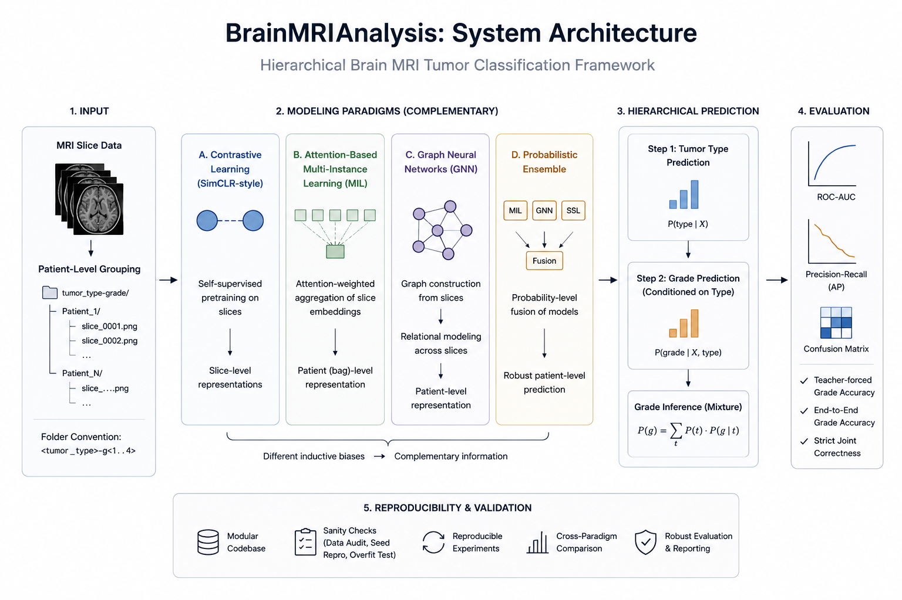

# Brain MRI Analysis

Research-grade modular framework for hierarchical brain MRI tumour classification using complementary representation learning and patient-level modelling paradigms.

This repository integrates:

* SimCLR-style contrastive learning,
* attention-based multi-instance learning (MIL),
* graph neural networks (GNN),
* and probabilistic ensemble modelling

for reproducible hierarchical tumour type and grade prediction from MRI slice data.

## Clinical Problem Context

Brain MRI analysis often requires patient-level reasoning across heterogeneous imaging slices with substantial variation in tumour appearance, grade distribution, and anatomical structure.

This repository explores how different representation learning paradigms can capture complementary information for hierarchical tumour type and grade prediction under reproducible research workflows.

## System Overview

<p align="center">
  
</p>

The framework combines multiple modelling paradigms to capture complementary inductive biases across slice-level, bag-level, and graph-level representations.

All supervised pipelines follow hierarchical factorisation:

```text
P(type, grade | X) = P(type | X) · P(grade | X, type)
```

Grade prediction is computed using probabilistic mixture inference:

```text
P(g) = Σ_t P(t) · P(g | t)
```

## Core Modeling Paradigms

| Module                  | Modeling Focus                 | Representation Level | Clinical Motivation             |
| ----------------------- | ------------------------------ | -------------------- | ------------------------------- |
| Contrastive Learning    | Representation invariance      | Slice-level          | limited labelled MRI data       |
| Multi-Instance Learning | Attention-weighted aggregation | Bag of slices        | patient-level slice aggregation |
| Graph Neural Networks   | Relational slice modeling      | Slice graph          | relational slice structure      |
| Ensemble                | Cross-model fusion             | Probability-level    | robustness across paradigms     |

## Key Capabilities

### Contrastive Learning

* SimCLR-style self-supervised pretraining
* Slice-level representation learning
* Encoder pretraining for downstream classification

### Attention-Based Multi-Instance Learning

* Patient-level bag aggregation
* Attention-weighted slice importance
* Two-stage tumour type and grade inference

### Graph Neural Networks

* Slice-level graph construction
* Relational feature propagation
* Graph-based patient representation learning

### Ensemble Modeling

* Probabilistic fusion across paradigms
* Cross-model aggregation
* Robust hierarchical prediction

### Evaluation

* ROC-AUC evaluation
* Precision-recall analysis
* Confusion matrix reporting
* Strict joint correctness evaluation
* Teacher-forced vs end-to-end grade evaluation

### Reproducibility

* Modular experimentation pipelines
* Deterministic workflows
* Sanity validation utilities
* Cross-paradigm benchmarking

## Experimental Philosophy

The repository prioritises:
- reproducible experimentation,
- modular comparison,
- patient-level evaluation integrity,
- and architectural interpretability.

The focus is on understanding representation behaviour and modelling trade-offs rather than maximising benchmark performance alone.

## Why This Project

The objective is not to identify a universally optimal architecture. Instead, the repository explores how different representation paradigms behave under patient-level reasoning tasks, limited data conditions, and modular experimentation settings common in medical imaging research.

Brain MRI classification requires robust patient-level reasoning across heterogeneous slice representations.

This repository explores:

* hierarchical tumour modelling,
* patient-level representation learning,
* relational slice reasoning,
* and modular cross-paradigm comparison

within reproducible MRI analysis workflows.

The focus is on research-oriented evaluation and architectural comparison rather than single-model optimisation.

## Research Questions Explored

This repository investigates several broader research questions:
- How should patient-level MRI information be aggregated across slices?
- Can graph-based representations improve relational modelling between slices?
- How does self-supervised pretraining affect downstream tumour classification?
- What trade-offs emerge between modularity, interpretability, and predictive performance?
- How stable are hierarchical prediction workflows across modelling paradigms?
  
## Repository Structure

```text
brainmrianalysis/
│
├── src/
│   ├── ContrastiveLearning/
│   ├── MultiInstanceLearning/
│   ├── GraphNeuralNetworks/
│   └── brainmrianalysis/
│
├── scripts/
├── tests/
├── requirements.txt
└── pyproject.toml
```

## Expected Dataset Layout

```text
DATA_ROOT/
  astrocytoma-g1/
    P1/
      slice_0001.png
      slice_0002.png

  glioblastoma-g4/
  meningioma-g2/
```

Folder naming convention:

```text
<tumor_type>-g<1..4>
```

## Installation

### Core Installation

```bash
pip install -r requirements.txt
```

### PyTorch Geometric

Graph Neural Network experiments require PyTorch Geometric:

https://pytorch-geometric.readthedocs.io/

### Optional Developer Tools

```bash
pip install pytest ruff black pre-commit
```

## Experimental Workflows

### 1. Contrastive Learning

```bash
python src/ContrastiveLearning/pretrain_simclr.py \
  --data_root /path/to/DATA_ROOT \
  --epochs 50 \
  --batch_size 64 \
  --encoder mobilenet_v2
```

Output:

```text
simclr_pretrain.pt
```

### 2. Attention-Based Multi-Instance Learning

```bash
python src/MultiInstanceLearning/train.py \
  --data_root /path/to/DATA_ROOT \
  --epochs 30 \
  --batch_size 2 \
  --bag_size 8 \
  --emb_dim 256 \
  --attn_dim 128
```

Full evaluation:

```bash
python src/MultiInstanceLearning/e2e_mil_two_step_pipeline.py \
  --data_root /path/to/DATA_ROOT
```

### 3. Graph Neural Networks

```bash
python src/GraphNeuralNetworks/e2e_two_step_pipeline.py \
  --data_root /path/to/DATA_ROOT \
  --epochs 40 \
  --bag_size 8 \
  --node_dim 64 \
  --hidden_dim 128
```

### 4. Probabilistic Ensemble

```bash
python src/MultiInstanceLearning/ensemble_two_step.py \
  --data_root /path/to/DATA_ROOT \
  --ckpt_mil runs/e2e_mil_two_step/best.pt \
  --ckpt_gnn runs/gnn_two_step_e2e/best.pt \
  --ckpt_ssl runs/e2e_simclr_two_step/mil_two_step_best.pt \
  --w_mil 1.0 \
  --w_gnn 1.0 \
  --w_ssl 1.0
```

## Evaluation Metrics

### Tumour Type Classification

* Accuracy
* Balanced Accuracy
* Macro / Weighted F1
* ROC-AUC
* Precision-Recall AP

### Grade Prediction

* Teacher-forced accuracy
* End-to-end grade accuracy
* Strict joint correctness

## Sanity Validation

### Data Audit

```bash
python scripts/sanity_data_audit.py \
  --data_root /path/to/DATA_ROOT
```

### Seed Reproducibility

```bash
python scripts/sanity_seed_repro.py \
  --data_root /path/to/DATA_ROOT
```

### Small-Sample Overfit Check

```bash
python src/MultiInstanceLearning/sanity_overfit_small.py \
  --data_root /path/to/DATA_ROOT
```

Expected training accuracy:

```text
~1.0
```

## Research Contributions

* Hierarchical tumour type → grade prediction
* Modular comparison across MRI modelling paradigms
* Patient-level multi-instance reasoning
* Relational graph-based MRI analysis
* Self-supervised MRI representation learning
* Probabilistic ensemble fusion for hierarchical prediction

## Intended Use

Designed for:

* brain MRI research,
* representation learning experimentation,
* graph-based medical imaging research,
* and reproducible hierarchical classification workflows.

Not intended for clinical deployment or medical decision-making.

## Current Research Directions

* Improved graph construction strategies
* Cross-paradigm feature alignment
* Robust patient-level aggregation
* Advanced self-supervised representation learning
* Calibration-aware hierarchical prediction
* Multi-modal neuroimaging extensions

## License

MIT License.

## Author

Toktam Khatibi
Senior Machine Learning Research Scientist

Clinical AI • Medical Imaging • Multimodal AI • Graph-Based Learning • Representation Learning
